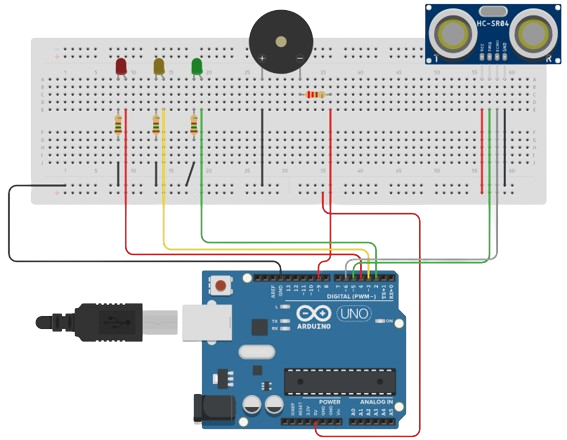

<div align="center" style="display: inline_block;">
  <a href="https://learn.microsoft.com/pt-br/cpp/cpp/?view=msvc-170" title="C++ | DOC" target="_blank" rel='noopener noreferrer'>
    
  </a>
    &nbsp;&nbsp;&nbsp;&nbsp;&nbsp;
  <a href="https://docs.arduino.cc/" title="Arduino | DOC" target="_blank" rel='noopener noreferrer'>
    
  </a>
</div><br>

<div align="center";>
  <h1>SENSOR ULTRASSÔNICO 📡</h1>
</div>
  
Este projeto em **C++** utiliza um sensor ultrassônico para medir distâncias e acionar LEDs (verde, amarelo, vermelho) e uma buzina conforme a proximidade de objetos detectada.

## 🧰 Componentes Utilizados

- Placa Arduino (Arduino Uno R3);
- Placa de ensaio;
- Três LEDs (Verde, Amarelo e Vermelho);
- Resistores (150 Ω e 220 Ω);
- Jumpers (Fios para conexão);
- Sensor de distância ultrassônico HC-SR04;
- Piezo (Buzina).

## ⚙️ Configuração

Certifique-se de que os componentes estão conectados aos seguintes pinos digitais na sua placa Arduino:

- **LED Verde:** Pino 2;
- **LED Amarelo:** Pino 3;
- **LED Vermelho:** Pino 4;
- **Trig:** Pino 5;
- **Echo:** Pino 6;
- **Piezo:** Pino 9.

## 👩‍💻 Funcionamento do Código Arduino

O código mede a distância usando o sensor ultrassônico, acionando os LEDs e a buzina conforme a proximidade detectada.

A função **setup()** configura e inicializa:

- Configura os pinos do Arduino:
    - **Sensor ultrassônico:**
        - **trig:** como saída;
        - **echo:** como entrada.
    - **LEDs:** como saída;
    - **Piezo:** como saída.

- Inicializa:
    - **LEDs:** desligados (LOW);
    - **Piezo:** desligado (LOW);
    - **Comunicação serial:** com a taxa de 9600 baud.

```cpp
void setup() {
  pinMode(trig, OUTPUT);
  pinMode(echo, INPUT);
  pinMode(LedVerde, OUTPUT);
  pinMode(LedAmarelo, OUTPUT);
  pinMode(LedVermelho, OUTPUT);
  pinMode(buzina, OUTPUT);

  digitalWrite(LedVerde, LOW);
  digitalWrite(LedAmarelo, LOW);
  digitalWrite(LedVermelho, LOW);
  noTone(buzina);

  Serial.begin(9600);
}
```

A função **loop()** define o comportamento:

- **Acende o LED 🟢:** emite um tom na buzina se a distância for entre 30 e 40 cm.
- **Acende o LED 🟡:** emite um tom diferente na buzina se a distância for entre 20 e 29 cm.
- **Acende o LED 🔴:** emite um tom mais baixo na buzina e inicia uma sequência intermitente se a distância for entre 10 e 19 cm.

```cpp
void loop() {
  digitalWrite(trig, LOW);
  delayMicroseconds(2);
  digitalWrite(trig, HIGH);
  delayMicroseconds(10);
  digitalWrite(trig, LOW);

  long duracao = pulseIn(echo, HIGH);
  int distancia = duracao * 0.034 / 2;

  if (distancia >= 30 && distancia <= 40) {
    digitalWrite(LedVerde, HIGH);
    tone(buzina, 1500);
  } else {
    noTone(buzina);
    digitalWrite(LedVerde, LOW);
    digitalWrite(LedAmarelo, LOW);
    digitalWrite(LedVermelho, LOW);
  }

  if (distancia >= 20 && distancia <= 29) {
    digitalWrite(LedAmarelo, HIGH);
    tone(buzina, 1100);
  }

  if (distancia >= 10 && distancia <= 19) {
    digitalWrite(LedVermelho, HIGH);
    tone(buzina, 950);

    while (digitalRead(LedVermelho) == HIGH) {
      digitalWrite(LedVermelho, HIGH);
      delay(1000);
      digitalWrite(LedVermelho, LOW);
      delay(1000);
    }
  }
}
```

## 🛠️ Como Utilizar

- Conecte o Arduino ao computador através do cabo USB.
- Carregue o código para o Arduino utilizando a IDE do Arduino ou outro software compatível.
- Observe os LEDs e ouça a buzina, determine a proximidade de objetos em relação ao sensor ultrassônico.

## 📸 Imagem do Projeto

<div align="center">
  <table>
    <tr>
      <td align="center">
        
      </td>
    </tr>
    <tr>
      <td align="center">
        <b>Figura 1:</b> Projeto do sensor ultrassônico com buzina e LEDs conectados a uma placa Arduino.
      </td>
    </tr>
  </table>
</div>
